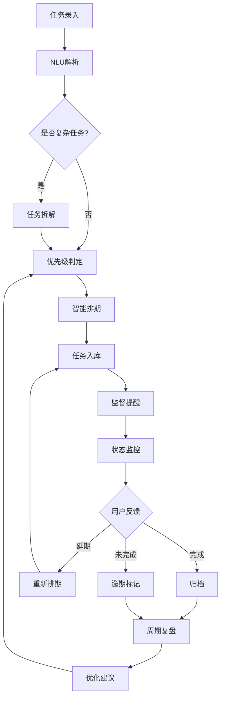

# 个人任务管理AI Agent - 产品需求文档

## 1. 产品概述

个人轻量化AI任务管理Agent，全自动、智能感知、自主调度的任务管理系统。区别于传统Todo清单，核心解决用户「任务杂乱、忘记截止时间、优先级混乱、拖延无规划、多场景任务分散」五大痛点。用户无需手动排版、分类、排期，通过自然语言交互自动接管个人任务全生命周期。

### 目标用户
- 个人用户：学习、办公、生活、副业等多场景任务管理
- 技术背景：适合个人开发者/普通用户，无需复杂配置

### 核心价值
- 全自主智能化：AI完成拆解、排期、复盘，用户仅需录入和执行
- 极致轻量化：零运维、低成本，适配PC/手机端
- 数据私密安全：本地存储为主，完全自主可控

## 2. 核心功能模块

### 2.1 用户角色
| 角色 | 权限 | 说明 |
|------|------|------|
| 个人用户 | 全部功能 | 单用户本地部署，无多用户系统 |

### 2.2 功能模块列表
1. **任务录入模块** - 自然语言解析、批量录入、碎片化随时录入
2. **任务拆解模块** - 大任务智能拆解为可执行子任务
3. **优先级管理模块** - 四维模型自动分级（紧急度+重要度+耗时+习惯）
4. **智能排期模块** - 结合作息自动生成日程计划，动态调整
5. **提醒预警模块** - 前置提醒、逾期预警、拖延督促
6. **状态管理模块** - 极简反馈自主更新、归档、延期处理
7. **复盘分析模块** - 日/周报告、统计分析、优化建议
8. **场景标签模块** - 办公、学习、生活、副业、社交等标签管理

## 3. 页面设计

### 3.1 页面结构
| 页面 | 路由 | 功能描述 |
|------|------|----------|
| 首页/仪表盘 | / | 今日任务概览、快速录入入口、核心指标展示 |
| 任务列表 | /tasks | 所有任务管理、筛选、搜索、状态操作 |
| 日程视图 | /schedule | 周视图/日视图、甘特图展示任务排期 |
| 复盘报告 | /review | 周期复盘数据、完成率分析、优化建议 |
| 设置页面 | /settings | 用户作息配置、提醒设置、场景标签管理 |

### 3.2 页面详细设计

#### 首页/仪表盘
| 模块 | 元素 | 交互 |
|------|------|------|
| 快速录入区 | 文本输入框、快捷指令按钮 | 回车提交，实时解析显示 |
| 今日任务卡片 | 任务列表、优先级标签、时间显示 | 点击完成/延期/编辑 |
| 核心指标 | 完成任务数、逾期数、待办数 | 动态数据展示 |
| 智能助手入口 | AI对话入口 | 快捷指令和问题反馈 |

#### 任务列表页
| 模块 | 元素 | 交互 |
|------|------|------|
| 筛选栏 | 场景标签、状态、优先级筛选 | 多条件组合筛选 |
| 任务卡片 | 任务名、截止时间、优先级、场景标签 | 滑动操作：完成/延期/删除 |
| 批量操作 | 全选、批量标记完成 | 高效批量管理 |

#### 日程视图页
| 模块 | 元素 | 交互 |
|------|------|------|
| 视图切换 | 日视图、周视图切换器 | 平滑切换动画 |
| 时间轴 | 24小时时间刻度 | 当前时间指示线 |
| 任务块 | 任务名称、耗时条形图 | 拖拽调整时间（可选） |
| 冲突提示 | 时间冲突红色标记 | 自动检测预警 |

#### 复盘报告页
| 模块 | 元素 | 交互 |
|------|------|------|
| 统计概览 | 周期完成率、逾期率、效率指数 | 图表可视化 |
| 任务分析 | 高频任务、拖延任务、耗时TOP榜 | 柱状图/饼图 |
| 优化建议 | AI生成的个性化建议列表 | 可点击查看详情 |
| 历史对比 | 本周期与上周期对比 | 趋势箭头展示 |

#### 设置页面
| 模块 | 元素 | 交互 |
|------|------|------|
| 作息配置 | 工作时间、休息时间、专注时段 | 时间选择器 |
| 提醒设置 | 提醒方式、提醒提前量 | 开关+数值设置 |
| 场景管理 | 标签增删改、颜色配置 | 可视化标签编辑 |

## 4. 核心流程

### 4.1 任务全生命周期流程
```
用户输入 → 自然语言解析 → 任务结构化 → 智能拆解(可选)
→ 优先级判定 → 智能排期 → 监督提醒 → 状态更新 → 周期复盘 → 优化反馈
```

### 4.2 流程图


## 5. 用户界面设计

### 5.1 设计风格
- **主题定位**：现代极简 + 智能科技感，体现AI的智能与可靠
- **色调方案**：
  - 主色：深蓝色 #1a1a2e（稳重、智能）
  - 次要色：渐变紫 #4a0e8f → #16213e（科技感）
  - 强调色：活力橙 #ff6b35（提醒、优先级高）
  - 背景色：深灰 #0f0f1a（护眼）
  - 文字色：#e8e8e8（主文字）、#888（次要文字）
- **圆角风格**：中圆角 12px，现代化卡片设计
- **阴影效果**：柔和发光阴影，营造悬浮感

### 5.2 字体选择
- **标题字体**：思源黑体 Bold / Noto Sans SC Bold（大气）
- **正文字体**：Inter / Noto Sans SC Regular（清晰易读）
- **数字字体**：Roboto Mono（时间、数据展示）

### 5.3 布局风格
- **整体布局**：左侧边栏导航 + 右侧主内容区
- **卡片设计**：深色卡片 + 微发光边框
- **间距系统**：8px基础单位，16px/24px/32px间距递进

### 5.4 动画效果
- **页面切换**：淡入淡出 + 轻微位移（300ms）
- **任务卡片**：悬停上浮 + 边框发光
- **数据更新**：数字滚动动画
- **加载状态**：脉冲呼吸动画

### 5.5 图标风格
- **图标库**：Lucide Icons（简洁线性风格）
- **优先级标识**：颜色渐变区分（红→橙→黄→绿）
- **场景标签**：圆角胶囊 + 不同色系区分

## 6. 响应式设计

### 6.1 断点设计
- **桌面端**：> 1200px（完整三栏布局）
- **平板端**：768px - 1200px（折叠侧边栏）
- **移动端**：< 768px（底部导航 + 单栏）

### 6.2 适配策略
- 桌面优先设计，移动端简化布局
- 触控优化：增大点击区域 44px
- 手势支持：滑动完成/删除任务

## 7. 数据指标

### 7.1 核心业务指标
- 任务完成率 = 已完成任务数 / 总任务数
- 按时完成率 = 按时完成任务数 / 应完成任务数
- 平均任务耗时 = 总耗时 / 完成任务数
- 逾期率 = 逾期任务数 / 总任务数

### 7.2 用户体验指标
- 任务录入转化率：自然语言 → 有效任务
- 提醒点击率：提醒 → 用户操作
- 复盘查看率：生成报告 → 用户查看

## 8. 优先级与MVP

### 8.1 MVP功能（第一阶段）
1. 自然语言任务录入（核心）
2. 任务列表展示与状态管理
3. 基础优先级分级
4. 手动/自动排期
5. 定时提醒
6. SQLite本地存储

### 8.2 第二阶段功能
1. 智能任务拆解
2. 自动排期算法
3. 冲突检测
4. 简易复盘报告

### 8.3 完全体功能
1. 自适应学习优化
2. 个性化复盘报告
3. 拖延督促机制
4. 多场景标签管理
