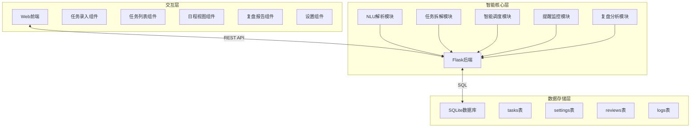

# 个人任务管理AI Agent - 技术架构文档

## 1. 架构设计

### 1.1 整体架构
采用三层轻量化架构，无复杂中间件，适合个人本地/轻量云部署。



### 1.2 技术栈选型

| 层级 | 技术选型 | 理由 |
|------|----------|------|
| 前端框架 | React 18 + Vite | 现代前端开发体验，热更新快 |
| UI组件库 | shadcn/ui + TailwindCSS | 组件丰富，支持深色主题定制 |
| 状态管理 | Zustand | 轻量级，无需复杂配置 |
| 后端框架 | Python Flask | 轻量脚本，开发简单、调试便捷 |
| 数据库 | SQLite | 零部署成本，本地存储，数据私密 |
| 大模型 | 通义千问 API | 国内可用，开箱即用，支持自然语言处理 |
| 提醒服务 | 浏览器通知 + WebSocket | 实时提醒，无需额外服务 |

## 2. 技术架构详解

### 2.1 前端架构
```
src/
├── components/          # 可复用组件
│   ├── TaskCard/        # 任务卡片
│   ├── TaskInput/       # 任务输入框
│   ├── CalendarView/    # 日程视图
│   └── Dashboard/       # 仪表盘
├── pages/               # 页面组件
│   ├── Home/           # 首页
│   ├── Tasks/          # 任务列表
│   ├── Schedule/       # 日程视图
│   ├── Review/         # 复盘报告
│   └── Settings/       # 设置页面
├── stores/              # Zustand状态管理
│   └── taskStore.ts    # 任务状态
├── services/            # API服务
│   └── api.ts          # 后端接口调用
├── utils/               # 工具函数
│   ├── nlp.ts          # NLP工具
│   └── date.ts         # 日期处理
└── App.tsx              # 应用入口
```

### 2.2 后端架构
```
backend/
├── app.py               # Flask应用入口
├── routes/             # 路由模块
│   ├── tasks.py        # 任务路由
│   ├── schedule.py     # 排期路由
│   └── review.py       # 复盘路由
├── services/           # 业务逻辑
│   ├── nlu_service.py  # NLU解析服务
│   ├── task_service.py # 任务服务
│   ├── schedule_service.py # 排期服务
│   └── review_service.py # 复盘服务
├── models/             # 数据模型
│   └── models.py       # SQLAlchemy模型
├── utils/              # 工具函数
│   └── llm.py          # 大模型调用
└── config.py           # 配置文件
```

## 3. 路由定义

### 3.1 前端路由
| 路由 | 页面 | 功能 |
|------|------|------|
| / | HomePage | 首页仪表盘 |
| /tasks | TasksPage | 任务列表管理 |
| /schedule | SchedulePage | 日程视图 |
| /review | ReviewPage | 复盘报告 |
| /settings | SettingsPage | 设置页面 |

### 3.2 后端API
| 方法 | 路由 | 描述 |
|------|------|------|
| POST | /api/tasks | 创建任务（支持自然语言） |
| GET | /api/tasks | 获取任务列表 |
| PUT | /api/tasks/:id | 更新任务 |
| DELETE | /api/tasks/:id | 删除任务 |
| PATCH | /api/tasks/:id/status | 更新任务状态 |
| POST | /api/tasks/:id/split | 拆解任务 |
| GET | /api/schedule | 获取日程安排 |
| POST | /api/schedule/optimize | 优化排期 |
| GET | /api/review/daily | 每日复盘 |
| GET | /api/review/weekly | 每周复盘 |
| GET | /api/settings | 获取设置 |
| PUT | /api/settings | 更新设置 |

## 4. API详细设计

### 4.1 创建任务接口
```typescript
// Request
POST /api/tasks
{
  "input": "明天下午3点写工作总结，大概2小时",
  "user_id": "default"
}

// Response
{
  "success": true,
  "data": {
    "id": "uuid-xxx",
    "content": "写工作总结",
    "deadline": "2024-01-15T15:00:00",
    "estimated_hours": 2,
    "priority": "high",
    "scenario": "work",
    "subtasks": [],
    "status": "pending",
    "created_at": "2024-01-14T10:00:00"
  }
}
```

### 4.2 更新任务状态
```typescript
// Request
PATCH /api/tasks/:id/status
{
  "status": "completed" | "pending" | "overdue" | "postponed"
}

// Response
{
  "success": true,
  "data": {
    "id": "uuid-xxx",
    "status": "completed",
    "updated_at": "2024-01-15T14:30:00"
  }
}
```

### 4.3 获取日程
```typescript
// Request
GET /api/schedule?start=2024-01-14&end=2024-01-20

// Response
{
  "success": true,
  "data": {
    "schedule": [
      {
        "id": "uuid-xxx",
        "content": "写工作总结",
        "date": "2024-01-15",
        "start_time": "15:00",
        "end_time": "17:00",
        "priority": "high",
        "status": "scheduled"
      }
    ],
    "conflicts": [],
    "suggestions": []
  }
}
```

### 4.4 获取复盘报告
```typescript
// Request
GET /api/review/weekly

// Response
{
  "success": true,
  "data": {
    "period": "2024-01-08 ~ 2024-01-14",
    "stats": {
      "total_tasks": 25,
      "completed": 20,
      "completion_rate": 80,
      "on_time_rate": 75,
      "avg_duration": 1.5
    },
    "analysis": {
      "top_delayed": ["项目汇报", "读书笔记"],
      "most_productive_day": "周三",
      "peak_hours": "14:00-17:00"
    },
    "suggestions": [
      "建议将复杂任务拆分为小任务，更易执行",
      "周三效率最高，可安排高难度任务"
    ]
  }
}
```

## 5. 数据模型

### 5.1 ER图
```mermaid
erDiagram
    TASK ||--o{ SUBTASK : contains
    TASK ||--o{ TASK_LOG : generates
    TASK ||--o{ REVIEW : appears_in
    USER ||--o{ TASK : owns
    USER ||--o| SETTINGS : has
    
    TASK {
        string id PK
        string content
        datetime deadline
        float estimated_hours
        int priority
        string scenario
        string status
        datetime created_at
        datetime updated_at
    }
    
    SUBTASK {
        string id PK
        string task_id FK
        string content
        boolean completed
        datetime created_at
    }
    
    TASK_LOG {
        string id PK
        string task_id FK
        string action
        datetime timestamp
    }
    
    REVIEW {
        string id PK
        date period_start
        date period_end
        json stats
        json analysis
        json suggestions
        datetime created_at
    }
    
    SETTINGS {
        string id PK
        time work_start
        time work_end
        array reminder_advance
        boolean notifications_enabled
        json custom_scenarios
        datetime updated_at
    }
}
```

### 5.2 数据表DDL

#### tasks表
```sql
CREATE TABLE tasks (
    id TEXT PRIMARY KEY,
    content TEXT NOT NULL,
    deadline DATETIME,
    estimated_hours REAL,
    priority INTEGER DEFAULT 2,
    scenario TEXT DEFAULT 'general',
    status TEXT DEFAULT 'pending',
    parent_id TEXT,
    created_at DATETIME DEFAULT CURRENT_TIMESTAMP,
    updated_at DATETIME DEFAULT CURRENT_TIMESTAMP,
    completed_at DATETIME,
    FOREIGN KEY (parent_id) REFERENCES tasks(id)
);

CREATE INDEX idx_tasks_status ON tasks(status);
CREATE INDEX idx_tasks_deadline ON tasks(deadline);
CREATE INDEX idx_tasks_priority ON tasks(priority);
CREATE INDEX idx_tasks_scenario ON tasks(scenario);
```

#### subtasks表
```sql
CREATE TABLE subtasks (
    id TEXT PRIMARY KEY,
    task_id TEXT NOT NULL,
    content TEXT NOT NULL,
    completed BOOLEAN DEFAULT FALSE,
    created_at DATETIME DEFAULT CURRENT_TIMESTAMP,
    FOREIGN KEY (task_id) REFERENCES tasks(id) ON DELETE CASCADE
);

CREATE INDEX idx_subtasks_task ON subtasks(task_id);
```

#### task_logs表
```sql
CREATE TABLE task_logs (
    id TEXT PRIMARY KEY,
    task_id TEXT NOT NULL,
    action TEXT NOT NULL,
    old_value TEXT,
    new_value TEXT,
    timestamp DATETIME DEFAULT CURRENT_TIMESTAMP,
    FOREIGN KEY (task_id) REFERENCES tasks(id) ON DELETE CASCADE
);

CREATE INDEX idx_logs_task ON task_logs(task_id);
CREATE INDEX idx_logs_timestamp ON task_logs(timestamp);
```

#### reviews表
```sql
CREATE TABLE reviews (
    id TEXT PRIMARY KEY,
    period_type TEXT NOT NULL,
    period_start DATE NOT NULL,
    period_end DATE NOT NULL,
    stats TEXT,
    analysis TEXT,
    suggestions TEXT,
    created_at DATETIME DEFAULT CURRENT_TIMESTAMP
);

CREATE INDEX idx_reviews_period ON reviews(period_start, period_end);
```

#### settings表
```sql
CREATE TABLE settings (
    id TEXT PRIMARY KEY DEFAULT 'default',
    work_start TEXT DEFAULT '09:00',
    work_end TEXT DEFAULT '18:00',
    reminder_advance TEXT DEFAULT '[30, 60]',
    notifications_enabled BOOLEAN DEFAULT TRUE,
    custom_scenarios TEXT DEFAULT '["work","study","life","side-project","social"]',
    updated_at DATETIME DEFAULT CURRENT_TIMESTAMP
);
```

## 6. 智能核心模块设计

### 6.1 NLU解析模块
**功能**：解析自然语言输入，提取结构化信息

**处理流程**：
1. 接收用户输入文本
2. 调用大模型API进行意图识别
3. 提取关键参数：任务内容、截止时间、预估耗时、场景标签
4. 返回标准化任务数据结构

**Prompt设计**：
```
你是一个任务解析助手。用户会输入自然语言描述的任务，
请提取以下信息并以JSON格式返回：
- content: 任务内容（去除时间描述）
- deadline: 截止时间（ISO格式，如无则为空）
- estimated_hours: 预估耗时（小时数）
- scenario: 场景标签（work/study/life/side-project/social/general）
- urgency: 紧急程度（1-4，4最高）

示例输入："明天下午3点写工作总结，大概2小时"
期望输出：{"content":"写工作总结","deadline":"2024-01-15T15:00:00","estimated_hours":2,"scenario":"work","urgency":3}
```

### 6.2 任务拆解模块
**功能**：将大任务拆解为可执行子任务

**拆解策略**：
1. 识别任务复杂度（通过关键词和字数判断）
2. 调用大模型进行层级拆解
3. 为每个子任务估算耗时
4. 生成执行顺序建议

### 6.3 智能排期模块
**功能**：基于用户作息和任务属性自动排期

**排期算法**：
1. 按优先级和紧急度排序任务
2. 在用户工作时段内寻找可用时间槽
3. 检测时间冲突
4. 生成排期建议，标记冲突任务

### 6.4 复盘分析模块
**功能**：统计任务数据，生成分析报告

**分析维度**：
- 完成率、按时完成率
- 任务耗时分布
- 高频拖延任务识别
- 最有效率时间段
- 与历史数据对比

## 7. 部署方案

### 7.1 开发环境
- Node.js 18+
- Python 3.10+
- SQLite 3

### 7.2 生产环境建议
- 前端：静态部署到Vercel/Netlify
- 后端：部署到Railway/Render免费层
- 数据库：SQLite文件存储，或迁移到PlanetScale

### 7.3 环境变量
```
# .env
VITE_API_BASE_URL=http://localhost:5000/api
LLM_API_KEY=your-api-key
LLM_BASE_URL=https://dashscope.aliyuncs.com/compatible-mode/v1
```
