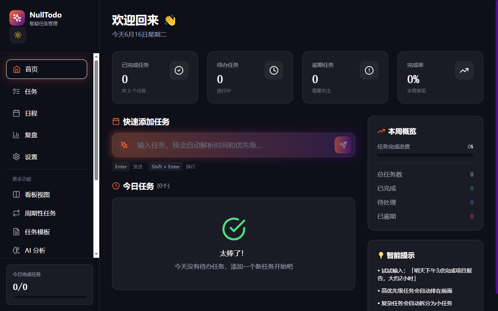
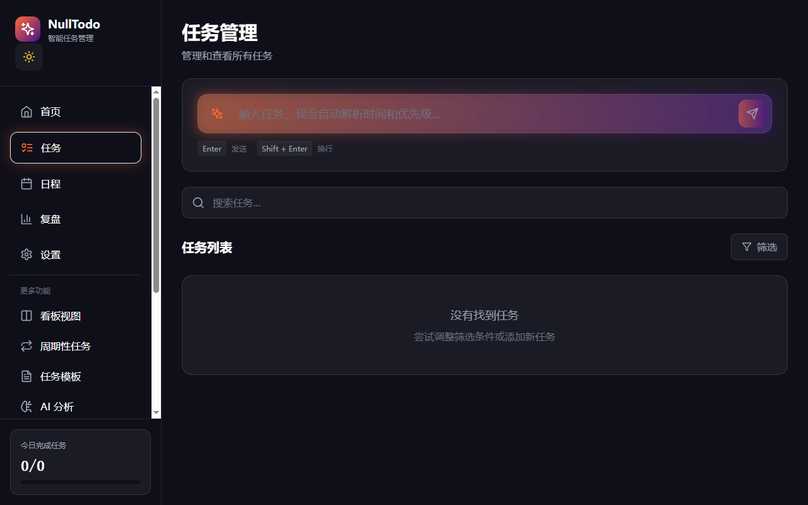
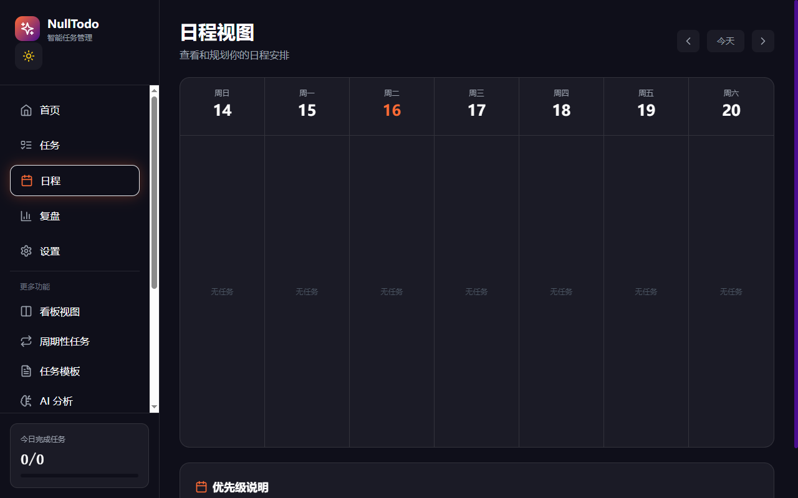
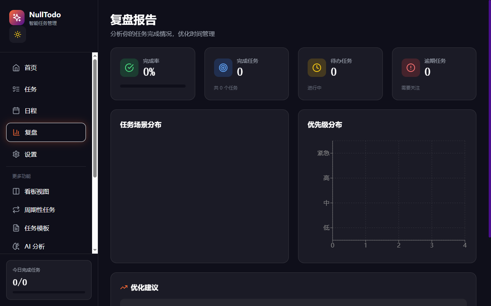
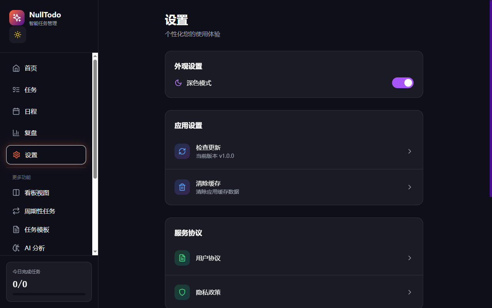

<div align="center">



# NullTodo

### 🤖 AI驱动的智能任务管理系统，让拖延症无处遁形

[](https://opensource.org/licenses/MIT)
[](http://makeapullrequest.com)
[](https://github.com/chungkung/nulltodo/releases)
[](https://nulltodo.vercel.app)
[](https://github.com/chungkung/nulltodo/stargazers)
[](https://github.com/chungkung/nulltodo/network/members)

**[在线演示](https://nulltodo.vercel.app)** • **[下载桌面版](https://github.com/chungkung/nulltodo/releases/latest)** • **[问题反馈](https://github.com/chungkung/nulltodo/issues)**

</div>

---

##  为什么选择 NullTodo？

**传统任务管理工具的痛点：**
- ❌ 手动输入繁琐，需要填写多个字段
- ❌ 无法识别拖延模式，总是最后时刻才完成
- ❌ 任务冲突检测弱，经常错过截止日期
- ❌ 数据存储在云端，隐私安全无保障
- ❌ 离线无法使用，依赖网络连接

**NullTodo 的解决方案：**
- ✅ **AI自然语言输入** - 一句话创建任务，自动解析所有信息
- ✅ **拖延模式分析** - 智能检测你的工作习惯，提前预警
- ✅ **智能调度引擎** - 自动检测冲突，建议最优执行顺序
- ✅ **本地优先架构** - 数据完全存储在本地，隐私安全
- ✅ **完全离线可用** - 无需网络，随时随地管理任务

---

## ✨ 核心特性

### 🤖 AI自然语言输入

输入"明天下午3点完成报告，2小时"，自动解析时间、优先级、场景。

<div align="center">
  
</div>

### 📊 智能首页

今日任务一目了然，统计数据实时更新。

<div align="center">
  
</div>

### 📅 日程视图

周历视图直观展示任务安排，轻松规划每一天。

<div align="center">
  
</div>

### 📈 复盘分析

自动分析任务完成情况，生成优化建议。

<div align="center">
  
</div>

### ⚙️ 个性化设置

深色模式、缓存清理、版本管理，打造专属体验。

<div align="center">
  
</div>

### 🚀 更多强大功能

-  **智能任务调度** - 自动检测时间冲突，建议最优执行顺序
- ✂️ **智能拆解** - 大任务自动拆分为可执行的子任务
- 🌙 **深色模式** - 护眼设计，适合长时间使用
- 📱 **多平台支持** - Windows桌面应用 / Web版本 / 移动端
- 🔔 **智能提醒** - 按时提醒、逾期预警、拖延督促
-  **周期复盘** - 自动生成日/周报告和优化建议

---

##  工作流程

**1️⃣ 自然语言输入** → **2️⃣ AI智能解析** → **3️⃣ 自动调度** → **4️⃣ 执行完成**

只需一句话，NullTodo 帮你完成所有繁琐的任务管理工作。

---

## 🚀 快速开始

### 🖥️ Windows 桌面应用（推荐）

<div align="center">
  <a href="https://github.com/chungkung/nulltodo/releases/latest">
    
  </a>
</div>

1. 下载最新版本的 [NullTodo Setup.exe](https://github.com/chungkung/nulltodo/releases/latest)
2. 双击安装，运行即可
3. 无需后端服务器，完全离线工作

### 🌐 Web 版本

```bash
# 克隆项目
git clone https://github.com/chungkung/nulltodo.git
cd nulltodo

# 安装依赖
npm install

# 启动开发服务器
npm run dev

# 访问 http://localhost:3000
```

### 📱 移动端

- **Android**: 查看 [发布页面](https://github.com/chungkung/nulltodo/releases) 下载 APK
- **iOS**: 即将推出，敬请期待

---

## 💡 使用示例

### 场景 1: 学生管理课程作业

```
输入: "下周五交数据结构作业，大概需要5小时，很重要"

自动解析:
✓ 内容: 数据结构作业
✓ 截止时间: 下周五
✓ 预估时长: 5小时
✓ 优先级: 高
✓ 场景: 学习
```

### 场景 2: 职场人士管理项目

```
输入: "明天下午3点准备客户演示PPT，需要2小时，紧急"

自动解析:
✓ 内容: 准备客户演示PPT
✓ 截止时间: 明天下午3点
✓ 预估时长: 2小时
✓ 优先级: 紧急
✓ 场景: 工作
```

### 场景 3: 自由职业者管理多个项目

```
输入: "这周末完成网站设计稿，大概8小时，中等优先级"

自动解析:
✓ 内容: 完成网站设计稿
✓ 截止时间: 这周末
✓ 预估时长: 8小时
✓ 优先级: 中
✓ 场景: 副业
```

---

## 📊 数据分析示例

NullTodo 会自动分析你的任务完成情况：

- **平均完成时间** - 了解你的工作效率
- **拖延率统计** - 识别拖延模式
- **最佳工作时段** - 找到你的高效时间
- **高风险任务预警** - 提前发现可能逾期的任务
- **个性化改进建议** - 基于数据给出优化方案

---

## 🛠️ 技术栈

<div align="center">
  <table>
    <tr>
      <td align="center" width="25%">
        
        <br/>React 18
      </td>
      <td align="center" width="25%">
        
        <br/>TypeScript
      </td>
      <td align="center" width="25%">
        
        <br/>Vite
      </td>
      <td align="center" width="25%">
        
        <br/>Electron
      </td>
    </tr>
    <tr>
      <td align="center">
        
        <br/>TailwindCSS
      </td>
      <td align="center">
        
        <br/>Python Flask
      </td>
      <td align="center">
        
        <br/>SQLite
      </td>
      <td align="center">
        
        <br/>Capacitor
      </td>
    </tr>
  </table>
</div>

---

## 📦 项目结构

```
nulltodo/
├── src/                    # 前端源码
│   ├── components/         # React组件
│   ├── pages/             # 页面
│   ├── stores/            # 状态管理
│   ├── services/          # API服务
│   └── utils/             # 工具函数
├── api/                   # 后端（可选）
│   ├── routes/            # API路由
│   ├── services/          # 业务逻辑
│   └── utils/             # 工具函数
├── electron/              # 桌面应用
├── android/               # Android应用
├── ios/                   # iOS应用
└── docs/                  # 文档和截图
```

---

## 🤝 贡献

欢迎贡献代码！请参阅 [CONTRIBUTING.md](CONTRIBUTING.md) 了解详情。

1. Fork 本项目
2. 创建特性分支 (`git checkout -b feature/AmazingFeature`)
3. 提交更改 (`git commit -m 'Add some AmazingFeature'`)
4. 推送到分支 (`git push origin feature/AmazingFeature`)
5. 创建 Pull Request

---

## 📝 开发计划

- [x] AI自然语言输入
- [x] 拖延模式分析
- [x] 智能任务调度
- [x] 本地优先架构
- [x] Windows桌面应用
- [x] Web版本
- [ ] 多语言支持（i18n）
- [ ] 任务模板库
- [ ] 番茄钟集成
- [ ] 更多AI分析功能
- [ ] 云同步（可选）

---

## 📄 许可证

本项目采用 MIT 许可证 - 详见 [LICENSE](LICENSE) 文件

---

## 🙏 致谢

- [React](https://reactjs.org/) - 用户界面构建库
- [TailwindCSS](https://tailwindcss.com/) - 实用优先的CSS框架
- [Electron](https://www.electronjs.org/) - 跨平台桌面应用框架
- [Vite](https://vitejs.dev/) - 下一代前端构建工具
- [Zustand](https://github.com/pmndrs/zustand) - 轻量级状态管理

---

<div align="center">

### 🌟 如果这个项目对你有帮助，请给一个 Star 支持！

**[⭐ Star this repo](https://github.com/chungkung/nulltodo)** • **[🍴 Fork this repo](https://github.com/chungkung/nulltodo/fork)** • **[📥 Download](https://github.com/chungkung/nulltodo/releases)**

[问题反馈](https://github.com/chungkung/nulltodo/issues) • [功能建议](https://github.com/chungkung/nulltodo/issues/new) • [贡献代码](https://github.com/chungkung/nulltodo/pulls)

</div>
